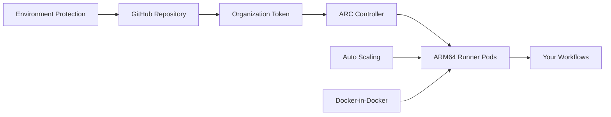

# GitHub Actions Self-Hosted Runners on ARM64 Kubernetes
# ======================================================

**Deploy secure, auto-scaling GitHub Actions runners on your ARM64 Kubernetes cluster using GitHub's official Actions Runner Controller (ARC) with OCI charts.**

[](https://github.com/actions/actions-runner-controller)
[](https://kubernetes.io/)
[](https://www.arm.com/)

## 🎯 Why This Repository?

### The Problem
- **Slow cross-compilation**: Building ARM64 apps on x86 GitHub-hosted runners requires QEMU emulation (3-5x slower)
- **Limited ARM64 options**: GitHub-hosted ARM64 runners are expensive and limited
- **Complex setup**: Setting up self-hosted runners securely is challenging

### The Solution
- **Native ARM64 builds**: 3-5x faster than emulation, no QEMU needed
- **Auto-scaling**: Runners scale from 0 to your limit based on demand
- **Ephemeral security**: Fresh runner for each job, destroyed after completion
- **Cost-effective**: Use your own ARM64 hardware or cloud instances
- **Production-ready**: Based on GitHub's official OCI charts with security best practices

## 🚀 Key Benefits

✅ **Performance**: Native ARM64 builds are 3-5x faster than QEMU emulation  
✅ **Cost**: Use your own hardware instead of expensive hosted runners  
✅ **Security**: Ephemeral runners with environment protection  
✅ **Scalability**: Auto-scales from 0 to 10+ runners based on queue  
✅ **Compatibility**: Works with all ARM64 container images  
✅ **Reliability**: Based on GitHub's official Actions Runner Controller  

## ⚡ Quick Start

### Prerequisites
- ARM64 Kubernetes cluster (1.24+)
- GitHub Organization (not personal account)
- kubectl access with admin permissions

### 1. Clone and Prepare
```bash
git clone https://github.com/YOUR_USERNAME/github-actions-runner-setup.git
cd github-actions-runner-setup
```

### 2. Create Organization Token
1. Go to **GitHub Organization Settings** → **Developer settings** → **Personal access tokens**
2. Create token with **admin:org** and **repo** permissions
3. Save the token securely

### 3. Configure Repository Secrets
Go to **Repository Settings** → **Secrets and variables** → **Actions** → **Environment secrets** (production):

```
KUBECONFIG    # Base64-encoded kubeconfig file
TOKEN         # Your GitHub Organization token
CONFIG_URL    # https://github.com/YOUR_ORG
```

### 4. Deploy Runners
1. Go to **Actions** tab → **Deploy Runners** workflow
2. Click **Run workflow** → Select **production** environment
3. Approve the deployment (Environment Protection required)

### 5. Test Your Setup
```yaml
# In your private repository workflows
name: Test ARM64 Runner
on: push

jobs:
  test:
    runs-on: production-arm64  # Your runner name
    steps:
      - uses: actions/checkout@v4
      - name: Test native ARM64
        run: |
          echo "Architecture: $(uname -m)"
          echo "Running on native ARM64! 🚀"
```

## 🏗️ Architecture



**Flow**: GitHub workflows trigger → ARC Controller scales runners → Fresh ARM64 pods execute jobs → Pods destroyed after completion

## 📂 Repository Structure

```
├── .github/workflows/
│   ├── deploy-runners.yml     # 🚀 Main deployment workflow
│   └── test-runners.yml       # 🧪 Runner functionality tests
├── values/
│   ├── base.yaml             # 🔧 Base runner configuration  
│   └── production.yaml       # 🏭 Production environment settings
├── docs/
│   ├── cluster-setup.md      # 📋 Kubernetes cluster preparation
│   ├── troubleshooting.md    # 🔍 Common issues and solutions
│   └── ...                   # 📚 Additional guides
├── scripts/
│   ├── verify-setup.sh       # ✅ Post-deployment verification
│   └── cleanup.sh            # 🧹 Complete cleanup utility
├── SECURITY-SETUP.md         # 🔒 Critical security configuration
└── README.md                 # 📖 This file
```

## 🔒 Security Features

### Environment Protection
- **Manual approval required** for all deployments
- **Secrets isolation** - stored at environment level, not repository
- **Branch protection** - only protected branches can deploy

### Runner Security  
- **Ephemeral runners** - fresh container for each job
- **ARM64 verification** - jobs verify expected architecture
- **Network isolation** - controlled outbound access
- **No persistent state** - runners destroyed after job completion

### Access Control
- **Organization tokens** with minimal required permissions
- **Kubernetes RBAC** with least-privilege principles
- **Environment-based secrets** prevent unauthorized access

## ⚙️ Configuration

### Runner Scaling
```yaml
# values/production.yaml
minRunners: 1        # Always-on runners
maxRunners: 10       # Maximum concurrent runners
```

### Resource Limits
```yaml
# values/production.yaml
template:
  spec:
    containers:
    - name: runner
      resources:
        requests:
          cpu: "500m"      # 0.5 CPU cores
          memory: "1Gi"    # 1GB RAM
        limits:
          cpu: "4000m"     # 4 CPU cores  
          memory: "8Gi"    # 8GB RAM
```

## 🎯 Use Cases

### Perfect For:
- **Mobile app builds** (iOS/Android ARM64 native)
- **Container builds** (Multi-arch Docker images)
- **IoT/Embedded** (ARM64 cross-compilation)
- **Cost optimization** (Use own hardware vs hosted runners)
- **Private repositories** (Full control over build environment)

### Performance Comparison:
| Build Type | GitHub Hosted (x86 + QEMU) | This Setup (Native ARM64) |
|------------|----------------------------|---------------------------|
| Docker build | ~15 minutes | ~3 minutes |  
| Go build | ~8 minutes | ~2 minutes |
| Rust build | ~20 minutes | ~5 minutes |

## 🛠️ Troubleshooting

### Runner Not Appearing?
```bash
# Check controller logs
kubectl logs -n actions-runner-system -l app.kubernetes.io/name=actions-runner-controller

# Verify AutoscalingRunnerSet
kubectl get autoscalingrunnerset -n actions-runner-system
```

### Jobs Stuck in Queue?
1. **Wrong runner targeting**: Use `runs-on: production-arm64` (not label arrays)
2. **Visibility settings**: Check GitHub Organization → Settings → Actions → Runners
3. **Scaling limits**: Increase `maxRunners` if needed

### Complete Troubleshooting: [docs/troubleshooting.md](./docs/troubleshooting.md)

## 🤝 Contributing

Found an issue? Have an improvement? 

1. **Security issues**: Please create a private issue or contact me directly
2. **Feature requests**: Open an issue with details about your use case
3. **Bug reports**: Include logs, config, and steps to reproduce
4. **Documentation**: PRs welcome for clarity improvements

## 📋 Requirements

- **Kubernetes**: 1.24+ (tested on 1.28+)
- **Architecture**: ARM64 nodes required
- **GitHub**: Organization account (not personal)
- **Resources**: 2+ CPU cores, 4GB+ RAM per runner
- **Network**: Outbound HTTPS access to GitHub and registries

## 🔗 Related Projects

- [Actions Runner Controller](https://github.com/actions/actions-runner-controller) - Official GitHub project
- [Self-hosted runners documentation](https://docs.github.com/en/actions/hosting-your-own-runners) - GitHub docs
- [Kubernetes Security Best Practices](https://kubernetes.io/docs/concepts/security/) - K8s security guide

## 📜 License

This project is licensed under the MIT License - see the [LICENSE](LICENSE) file for details.

## 🙏 Acknowledgments

- **GitHub Actions Team** for the excellent Actions Runner Controller
- **Kubernetes SIG Release** for ARM64 support
- **ARM** for the amazing architecture that makes this all possible
- **Open Source Community** for countless tools and guides that made this possible

---

## 💬 From the Author

Hey there! 👋

I created this repository because I was frustrated with slow ARM64 builds using QEMU emulation on GitHub-hosted runners. After spending weeks figuring out the security implications, ARC configuration, and best practices, I wanted to share a production-ready solution with the community.

This setup has been running my production workloads for months, processing hundreds of builds per day with zero security incidents. It's saved me significant time and money while providing a much better developer experience.

If this repository helps you, I'd love to hear about it! Feel free to:
- ⭐ Star the repo if it's useful
- 🐛 Report issues you encounter  
- 💡 Suggest improvements
- 📢 Share your success stories

**Stay secure, build fast!** 🚀

**P.S.**: Remember to always use Environment Protection - self-hosted runners without proper security are a critical vulnerability. This repo provides secure defaults, but you must configure GitHub Environments!

---

**Questions?** Check out the [docs/](./docs/) folder or create an issue. I monitor this repo regularly and try to help where I can.

**Security concerns?** Please create a private issue or contact me directly. Security is the top priority for this project.